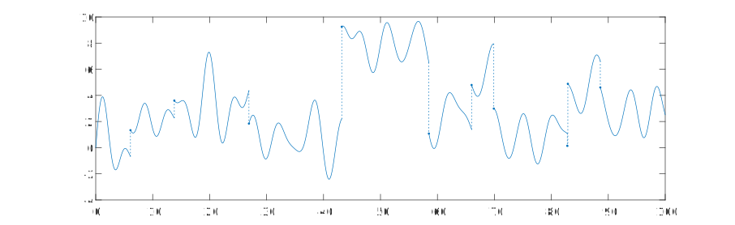

# tsplot
Utility to plot piecewise continuous timeseries.

For example, Calling <code>tsplot(ts)</code> in MATLAB, where <code>ts</code> is a timeseries object that has discontinuities (indicated by repeated time points), results in the plot shown below with dotted lines across the discontinuities.

