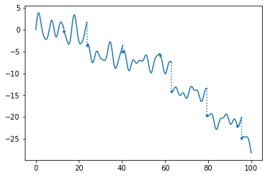

# tsplot
Utility to plot piecewise continuous timeseries.

For example, Calling <code>tsplot(ts)</code> in MATLAB, where <code>ts</code> is a [timeseries](https://www.mathworks.com/help/matlab/ref/timeseries.html) object that has discontinuities (indicated by repeated time points), results in the plot shown below with dotted lines across the discontinuities.

<code>tsplot.py</code> implements the python version (has both tsplot function and the gents driver). The generated plots look like this:

